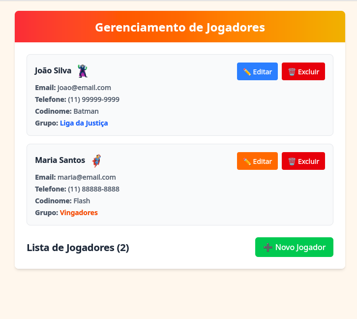
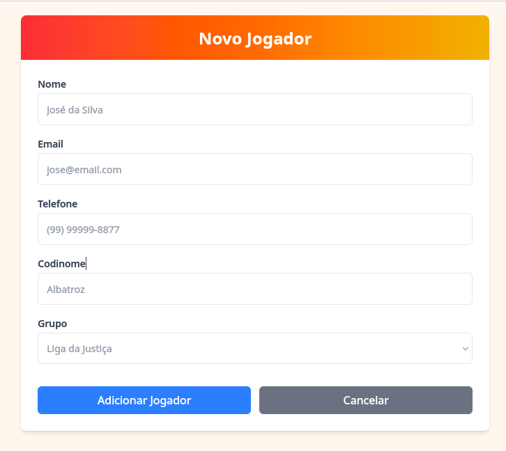
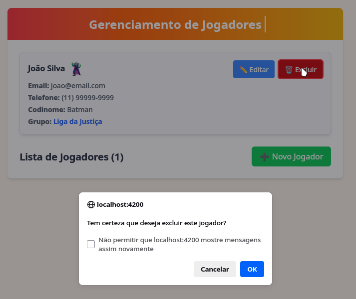
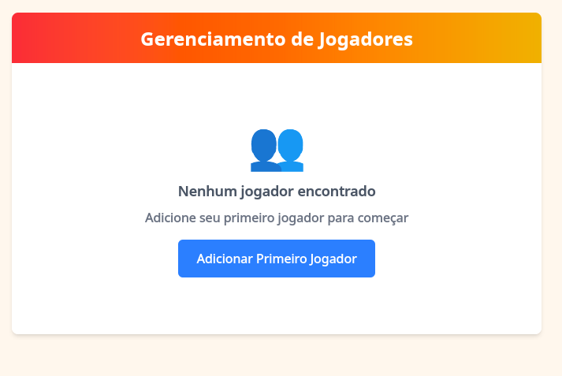

# Sistema de Cadastro de Jogadores
<p align="left">
  
  
  
</p>

## 1. 📝 Descrição
API para cadastro e gerenciamento de jogadores com codinomes dos Vingadores e Liga da Justiça.

### 🗂️ Imagens do Projeto(frontend)

<details>
    <summary><b>Lista de jogadores</b></summary>
    
</details>
<details>
    <summary><b>Cadastro de jogadores</b></summary>
    
</details>
<details>
    <summary><b>Remoção de jogador</b></summary>
    
</details>
<details>
    <summary><b>Nenhum jogador</b></summary>
    
</details>

## 2. 🚀 Funcionalidades
* Cadastro de jogadores com codinomes únicos
* Integração com APIs externas para obter codinomes
* Validação de email único
* Gerenciamento de grupos (Vingadores e Liga da Justiça)

## 3. 🏛️ Arquitetura

O sistema utiliza Spring Boot com arquitetura MVC, integrando-se com APIs externas para obter codinomes 
disponíveis e garantindo que não haja duplicação.

<details>
    <summary><b>Diagrama de componentes</b></summary>
    ```mermaid
      flowchart TD
      A[Frontend] -->|HTTP| B[JogadorController]
      B --> C[JogadorService]
      C --> D[JogadorRepository]
      C --> E[CodinomeService]
      E -->|HTTP| F[API Vingadores]
      E -->|HTTP| G[API Liga da Justiça]
      D --> H[H2 Database]
    ```
</details>


## 4. 🛠️ Tecnologias

Frameworks, bibliotecas e ferramentas.
- **Linguagem**: Java
- **Framework**: Spring Boot
- **Gerenciador de Dependências**: Maven
- **Banco de Dados**: H2 Database(dev)
- **Segurança**: Spring Security, JWT Token
- **Testes**: JUnit, Mockito
- **Utilitários**: Lombok, MapStruct
- **Documentação da API**: SpringDoc OpenAPI

## 5. ⚙️ Pré-requisitos

* Java 17+
* Maven

## 6. 📦 Instalação
* Passos para configurar o projeto localmente.
```bash
git clone https://github.com/brtiago/cadastro-de-jogadores.git  
cd cadastro-de-jogadores  
mvn spring-boot:run
```

## 7. 📚 Documentação da API (Swagger/OpenAPI)
- **Swagger UI**: Disponível em `http://localhost:8080/swagger-ui/index.html` após iniciar a aplicação.
- **OpenAPI (JSON)**: `http://localhost:8080/v3/api-docs`

## 8. 📂 Estrutura do Projeto (MVC)

``` plaintext
src/
├── main/
│   ├── com/example/cadastro_de_jogadores
│   │   ├── config/            → Configurações globais (Security, RabbitMQ, Swagger)
│   │   ├── controller/        → Endpoints REST (@RestController)
│   │   ├── model/             → Entidades JPA, DTOs, Enums
│   │   ├── repository/        → Interfaces Spring Data JPA
│   │   ├── service/           → Lógica de negócio (@Service)
│   │   └── exception/         → Tratamento de erros (@ControllerAdvice)
│   └── resources/
│       ├── db/migration/      → Scripts Flyway (V1__Create_tables.sql)
│       ├── application.yml    → Configs do Spring
│       └── swagger.yaml       → Documentação OpenAPI
```

## 9. 🧪 Testes
Em desenvolvimento

## 10. 🤝 Como Contribuir
* Faça um fork do projeto
* Crie uma branch (`git checkout -b feature/nova-feature`)

## 11. 📄 Licença


## 12. 📬 Contato
👩‍💻 Projeto desenvolvido por [Tiago Ribeiro](https://www.linkedin.com/in/tgribeiro/)

🤝 Fique à vontade para contribuir!